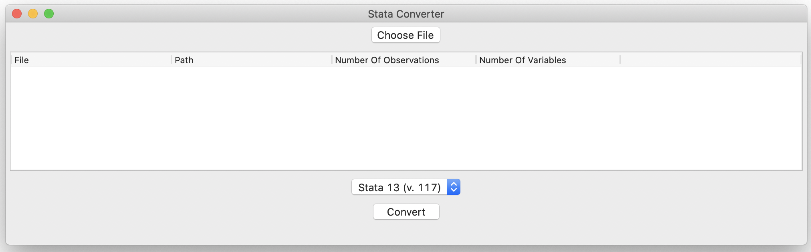

# stata_converter
This programs converts newer versions of Stata files into older versions.

You need to install the packages from `requirements.txt`. To do so, run
```
pip install -r requirements.txt
```

To launch the program, run (not the w at the end of `python`):
```
pythonw converter.py
```
The program will let you choose the file to convert. It will save a new version of the file you selected with the extension _v13. This file can be read from Stata versions compatible with version v13.

Preview of the program:

